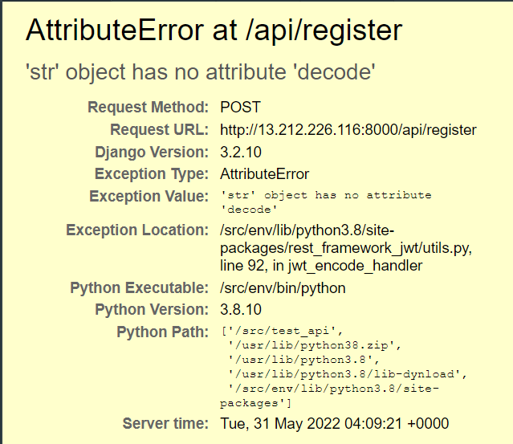
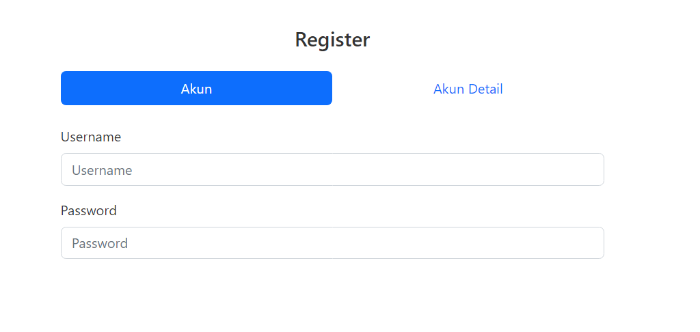

# Fetch API

### Kendala 1
Pada saat mencoba mengirim data dari aplikasi Insomnia (sejenis POSTMAN), terdapat error seperti berikut :


Untuk memperbaiki error tersebut, saya menemukan beberapa cara salah satunya adalah dengan **Downgrade Versi PyJWT**

### Kendala 2
Saat mencoba mengirim data melalui web yang dibuat, terdapat error cors

### Screenshot


### Teknologi
Teknologi yang saya gunakan :
- Bootstrap 5
- Axios
- Svelte
- Routify

### Menjalankan Project
```bash
# Clone this project
$ git clone https://github.com/suryamsj/test-frontend

# Access
$ cd test-frontend/fetch_api

# Install dependencies
$ npm install

# Run the project
$ npm run dev

# The server will initialize in the <http://localhost:5000>
```